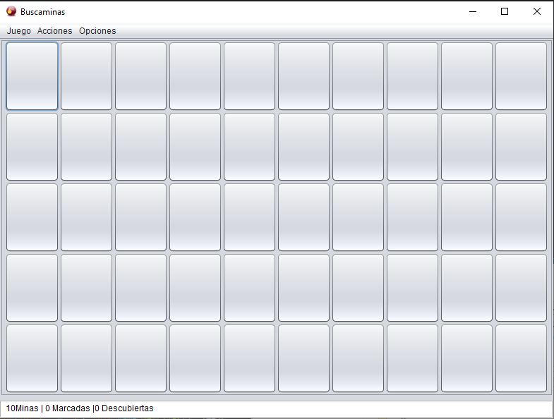
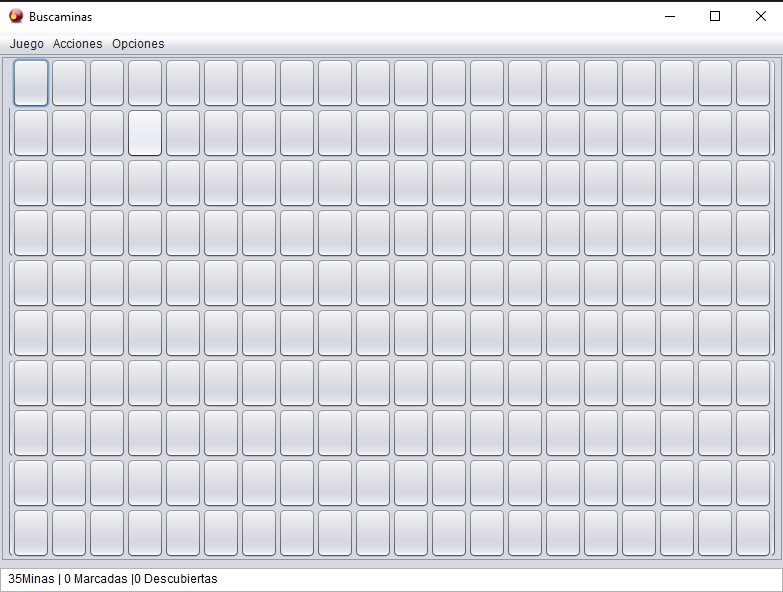
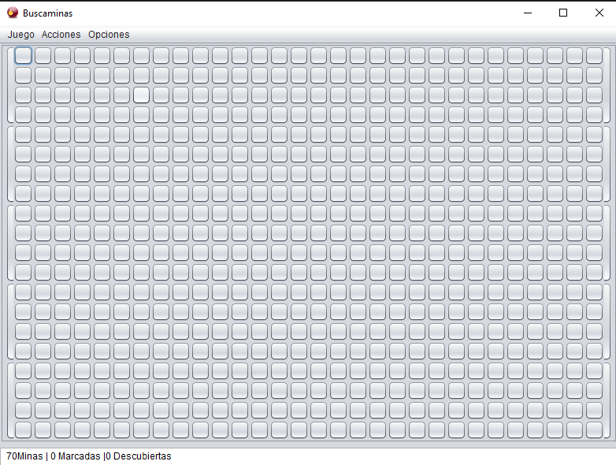
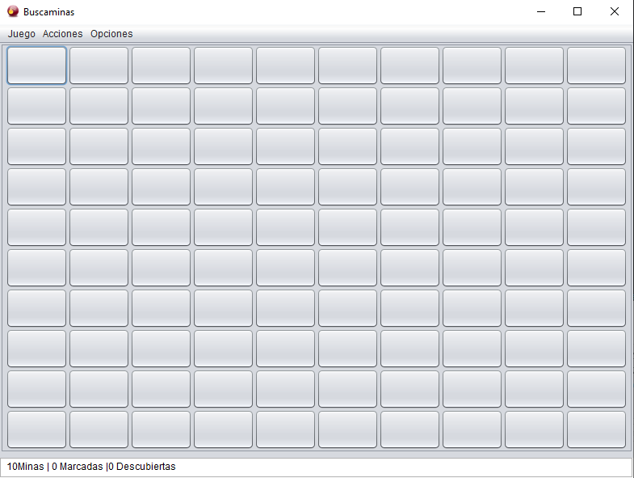
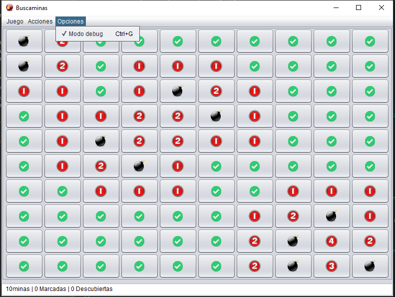
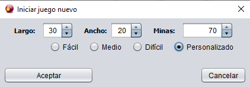

# 💣 Buscaminas en Java

---

## 🎯 Descripción

Este proyecto es una implementación del clásico **Buscaminas**, desarrollada completamente en **Java (Swing)**.  
Permite seleccionar distintos niveles de dificultad, activar un **modo debug** para visualizar las minas y crear partidas personalizadas con número de filas, columnas y minas a elección del jugador.

---

## 🕹️ Características principales

- 🎮 **Tres niveles de dificultad:** fácil, medio y difícil.  
- ⚙️ **Modo personalizado:** define filas, columnas y cantidad de minas.  
- 🧩 **Modo debug:** muestra la posición de las minas (ideal para pruebas).  
- 💡 Interfaz gráfica con **Java Swing**.  
- 🏁 Contadores dinámicos de minas y celdas descubiertas.

---

## 📁 Estructura del proyecto

	Buscaminas
	│
	├── src/
	│   ├── main/
	│   │   ├── CeldaVisual.java
	│   │   ├── DialogoJuegoNuevo.java
	│   │   └── VentanaPrincipal.java
	│   │
	│   └── motor/
	│       ├── Celda.java
	│       ├── Juego.java
	│       ├── Posicion.java
	│       └── Tablero.java
	│
	├── res/
	│
	├── Buscaminas.jar
	│
	└── ReadMe.md

---

## 📸 Capturas de pantalla

### 🟢 Modo fácil

### 🟡 Modo medio

### 🔴 Modo difícil

### ⚙️ Juego estándar

### 🧨 Modo debug

### 🔧 Configuración de nueva partida

---

## 🚀 Cómo ejecutar

1. Compila el proyecto desde tu IDE preferido (por ejemplo, IntelliJ, NetBeans o VS Code con soporte Java).  
2. Ejecuta la clase principal del programa (`Buscaminas.java` o equivalente).  
3. Selecciona una dificultad o crea tu propia configuración.  
4. ¡Empieza a jugar y evita las minas! 💥

---

## 🧠 Tecnologías utilizadas

- **Lenguaje:** Java  
- **Interfaz gráfica:** Swing  
- **Paradigma:** Programación orientada a objetos (POO)

---

---

## 🧩 Autor

Desarrollado por **Daniel Alejandro Torres Abella**  
🎓Ingeniero Electrónico — Universidad El Bosque  

---
